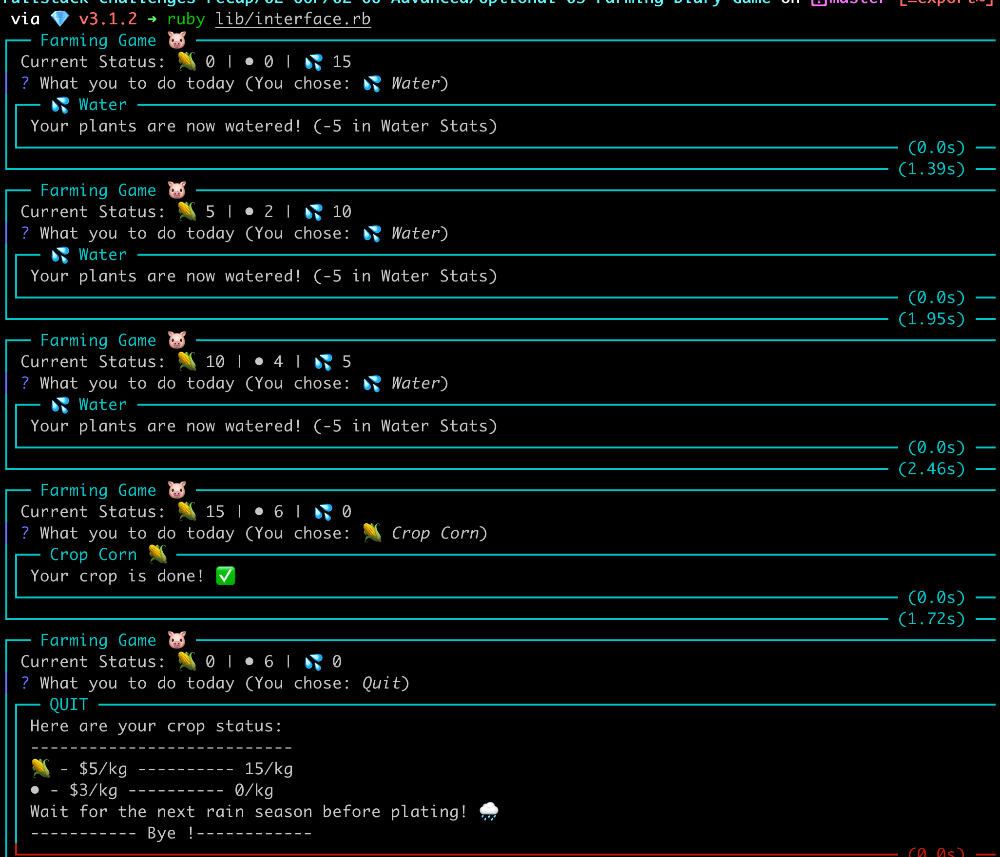

### Farming Game 🐷

This is a simple ruby Farming Game made during the Le Wagon Batch #1040!

It shows some concepts of classes, superclasses and Subclasses in Ruby and user the `cli-ui` Shopify gem.

#### Setup
First, we need to install `cli-ui` gem
> `gem install cli-ui`

#### Running the Game
To run the game, just type: 
> `ruby interface.rb`

